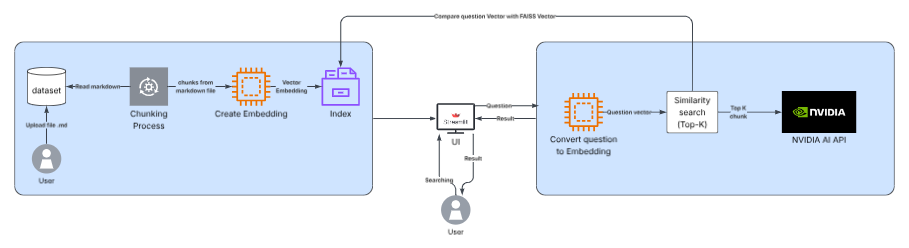

# Course Notes AI Search System

A Retrieval-Augmented Generation (RAG) search system developed for the **CS382 Search Engine & Information Retrieval** final project.

The system allows users to search their own course notes and receive answers based only on the uploaded documents. It uses vector search with FAISS and generates grounded responses using the NVIDIA AI API. Every answer includes the source notes used to generate the response.

---

## Features

- Search course notes using RAG
- Supports Markdown (`.md`) files
- FAISS vector search
- Sentence Transformer embeddings
- NVIDIA AI for answer generation
- Source citations for every answer
- Streamlit web interface
- Automatic index rebuild when the dataset changes

---

## Technologies

- Python 3.11+
- Streamlit
- FAISS
- Sentence Transformers
- NVIDIA AI API
- Markdown

---

# System Architecture

> 

---

## Project Structure

```
dataset/
│
├── app.py
├── config.py
├── requirements.txt
├── .env.example
│
├── ingestion/
├── embeddings/
├── vectorstore/
├── retrieval/
├── generation/
└── utils/
```

---

## How It Works

1. Load all Markdown course notes from the `dataset` folder.
2. Split the notes into smaller chunks.
3. Convert each chunk into embeddings.
4. Store the embeddings in a FAISS vector index.
5. Convert the user's question into an embedding.
6. Retrieve the most relevant note chunks.
7. Send the retrieved content to the NVIDIA AI model.
8. Display the answer with source citations.

---

## Installation

### Requirements

- Python 3.11 or newer

### Install

```bash
python -m venv venv

# Windows
venv\Scripts\activate

# macOS/Linux
# source venv/bin/activate

pip install -r requirements.txt
```

Create a `.env` file.

```
NVIDIA_API_KEY=your_api_key
NVIDIA_MODEL=nvidia/nemotron-3-super-120b-a12b
```

Add your Markdown course notes into the `dataset` folder.

---

## Run the Project

```bash
streamlit run app.py
```

Open your browser:

```
http://localhost:8501
```

The first run will create the FAISS index.

Later runs will reuse the existing index unless the dataset changes.

---

## Adding New Notes

1. Add a new `.md` file into the `dataset` folder.
2. Click **Rebuild Index** in the sidebar, or restart the application.

The system will automatically update the vector index.

---

## Settings

The sidebar allows you to change:

- Top-K retrieval
- Embedding model
- Rebuild vector index
- Dataset information

---

## Evaluation

The project includes an evaluation page with several predefined test questions.

The evaluation covers:

- Course-related questions
- Off-topic questions
- Multi-part questions

The results show retrieval quality, generated answers, and source citations.

---

## Limitations

- Works best with well-formatted Markdown notes.
- OCR errors from converted PDFs may reduce retrieval quality.
- Conversation history is not saved.
- Very complex multi-part questions may reduce retrieval accuracy.

---

## Deployment

This project can be deployed on **Streamlit Community Cloud**.

### Steps

1. Upload the project to GitHub.
2. Create a new Streamlit app.
3. Add the NVIDIA API key in **Secrets**.

```toml
NVIDIA_API_KEY="your_api_key"
NVIDIA_MODEL="nvidia/nemotron-3-super-120b-a12b"
```

4. Deploy the application.

---

## Future Improvements

Possible improvements include:

- Support for PDF documents without conversion.
- Better query decomposition for complex questions.
- Conversation history.
- More evaluation datasets.
- Additional embedding models.

---

## Author

Developed as the final project for

**CS382 – Search Engine & Information Retrieval**